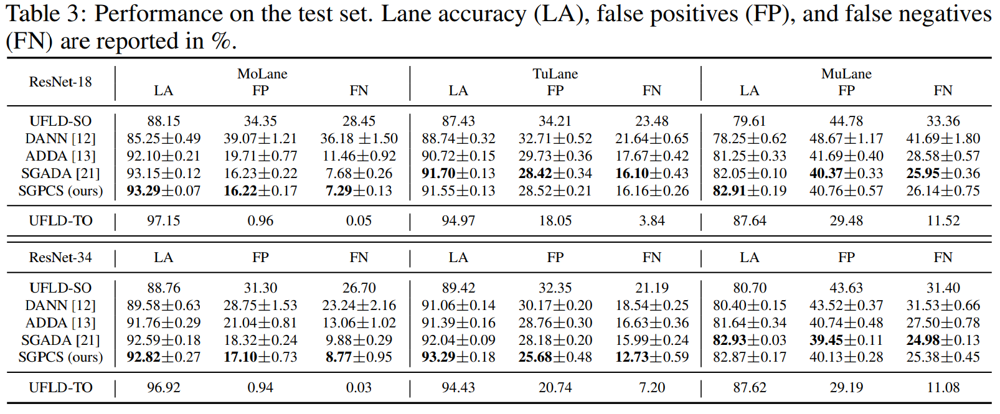

# CARLANE Baselines
Official implementation of the CARLANE Baselines used in the paper [CARLANE: A Lane Detection Benchmark for Unsupervised Domain Adaptation from Simulation to multiple Real-World Domains](https://proceedings.neurips.cc/paper_files/paper/2022/hash/19a260641ebaf68d412f427e591bb74a-Abstract-Datasets_and_Benchmarks.html). 

:house_with_garden: [CARLANE Homepage](https://carlanebenchmark.github.io/)

:floppy_disk: [CARLANE Dataset](https://www.kaggle.com/datasets/carlanebenchmark/carlane-benchmark)

:rocket: [Getting Started](https://www.kaggle.com/code/carlanebenchmark/getting-started)

**Refer to the official [UFLD PyTorch implementation](https://github.com/cfzd/Ultra-Fast-Lane-Detection) for the UFLD-SO and UFLD-TO baselines.**

**For the quantitative and qualitative evaluation of all models, use the evaluation code inside [UFLD-SGPCS](https://github.com/juliangebele/CARLANE/blob/master/CARLANE%20Baselines/UFLD-SGPCS/pcs/test.py).**

## Baselines
This repository contains the following baselines:
- [UFLD-DANN](https://github.com/juliangebele/CARLANE/tree/master/CARLANE%20Baselines/UFLD-DANN)
- [UFLD-ADDA](https://github.com/juliangebele/CARLANE/tree/master/CARLANE%20Baselines/UFLD-ADDA)
- [UFLD-SGADA](https://github.com/juliangebele/CARLANE/tree/master/CARLANE%20Baselines/UFLD-SGADA)
- [UFLD-SGPCS](https://github.com/juliangebele/CARLANE/tree/master/CARLANE%20Baselines/UFLD-SGPCS)

# Results

Weights can be downloaded from our [Homepage](https://carlanebenchmark.github.io/).
