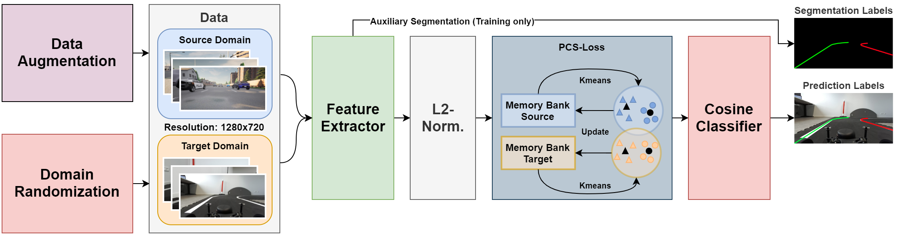

# UFLD-SGPCS
Official PyTorch implementation of UFLD-SGPCS used in the paper "CARLANE: A Lane Detection Benchmark for Unsupervised Domain Adaptation from Simulation to multiple Real-World Domains".


## Overview



## Environment
- Python 3.8 
- PyTorch 1.8.1

## Installation
Install the required python modules with

```bash
pip install -r requirements.txt
pip install -e .
```

or use a Docker Container

```bash
docker build -t ufld_sgpcs_docker .
```


## Getting started
- Reference your dataset root in your config file under `data_root`
- Check other parameters in the config

If you use Docker, use the following command to launch a container with a single gpu
```bash
docker run -it --rm --gpus device=0 --cpus 32 --ipc=host -v $PWD:/path_to_main_dir/ -w /path_to_main_dir/ ufld_sgpcs_docker
```

For multiple GPUs, use
```bash
docker run -it --rm --gpus '"device=0,1"' --cpus 32 --ipc=host -v $PWD:/path_to_main_dir/ -w /path_to_main_dir/ ufld_sgpcs_docker
```

### Generate pseudo labels before you start training
Check parameters like `input file`, `model_path` and `num_lanes`

```bash
python pcs/generate_pseudo_labels.py --config config/molane_test.json
```

### Training
Train the model on MoLane with the following command:
```bash
python pcs/train.py --config config/molane_train.json
```

## Evaluation
All validation and testing of **every UFLD-Model** (i.e. UFLD-DANN, UFLD-ADDA, UFLD-SGADA & UFLD-SGPCS) was done using this repo's testing code.

The evaluation code is modified from [Ultra Fast Lane Detection](https://github.com/cfzd/Ultra-Fast-Lane-Detection) and [Tusimple Benchmark](https://github.com/TuSimple/tusimple-benchmark).

### Testing & validation
For testing and validation, use the following parameter in the config file
```bash
output_params: {
  output_mode = ["test"]
}
```

For testing the network output on MoLane with the [Tusimple Benchmark Metric](https://github.com/TuSimple/tusimple-benchmark), run the following command:
```bash
python pcs/test.py --config config/molane_test.json
```

For validating the network output with the [Ultra Fast Lane Detection Metric](https://github.com/cfzd/Ultra-Fast-Lane-Detection), run the following command:
```bash
python pcs/validate.py --config config/molane_test.json
```

### Video Visualization
For visualizing the output, use the following parameter in the config file
```bash
output_params: {
  output_mode = ["video"]
}
```

### Json export
For saving the output as .json file, use the following parameter in the config file
```bash
output_params: {
  output_mode = ["json"]
}
```

## Acknowlegdement
This code is built on [Ultra Fast Lane Detection](https://github.com/cfzd/Ultra-Fast-Lane-Detection)
and [Prototypical Cross-domain Self-supervised Learning for Few-shot Unsupervised Domain Adaptation](https://github.com/zhengzangw/PCS-FUDA). 
We thank the authors for sharing their code.
