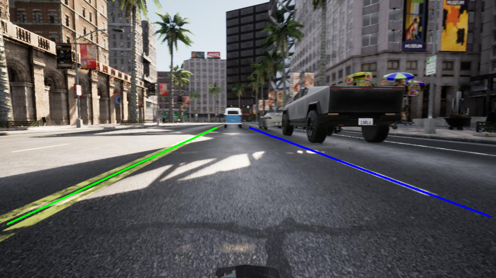

# CARLA Lane Generator

Official implementation of the CARLA Lane Generator used in the paper "CARLANE: A Lane Detection Benchmark for Unsupervised Domain Adaptation from Simulation to multiple Real-World Domains".

This repository is used for generating annotated images in CARLA with 2 or 4 lanes, collected by a self-roaming agent. 



## Installation

Make sure, that CARLA simulator is installed. The recommended version to install  is ```version 0.9.11```. You can also run it on an older version of CARLA, but at your own risk. If you want to stay on the safe side, just install the version mentioned above.

---

CARLA Simulator can be installed using the following link:
[https://github.com/carla-simulator/carla/blob/master/Docs/download.md](https://github.com/carla-simulator/carla/blob/master/Docs/download.md)

For more information on installation and builds refer to CARLA's official github respository.

For this project do the following:
1. Locate your CARLA installation folder and navigate to the ```PythonAPI``` directory:
	```Shell
	cd CARLA_0.9.11\WindowsNoEditor\PythonAPI
	```
2. Clone the project.
	```Shell
	git clone github-repo
	cd your-directory
	```
3. Install necessary dependencies.
	```Shell
	pip install -r requirements.txt
	```

## Getting Started

Make sure that your CARLA Server is running. Execute `fast_lane_detection_molane.py` or `fast_lane_detection_tulane.py` in the commandline. These scripts differ in curve_types and camera_angles. Check the config file for desired parameters. 

Recommended Maps are Town03, Town04, Town05, Town06, Town10HD.

For randomized weather and daytime, run `dynamic_weather.py` in another console. 

## Acknowledgements
Thanks to [sagnibak](https://github.com/sagnibak) for his work on figuring out how to efficiently save image data in CARLA with .npy. Without his work, it would have been a lot more time consuming regarding this problem. For more information refer to his self-driving car project on Github: https://github.com/sagnibak/self-driving-car